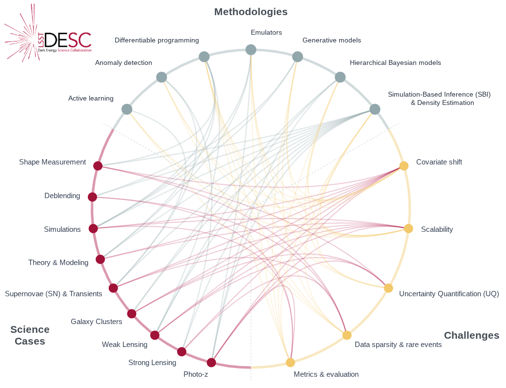

# Opportunities in AI/ML for the Rubin LSST Dark Energy Science Collaboration
[](https://doi.org/10.5281/zenodo.18319954) [](https://arxiv.org/abs/2601.14235) [](https://zenodo.org/records/18319954/files/main.pdf) [](https://creativecommons.org/licenses/by/4.0/)

This repository contains the LaTeX source for the **AI for DESC Task Force** white paper, which presents an overview of artificial intelligence and machine learning integration into the LSST Dark Energy Science Collaboration (DESC).



An interactive version of this chord diagram showing the connections between DESC science applications, AI/ML methodologies, and shared challenges is available at:
https://lsstdesc.org/AI_For_DESC/figures/chord-diagram.html


## Overview

The Vera C. Rubin Observatory's Legacy Survey of Space and Time (LSST) will produce unprecedented volumes of heterogeneous astronomical data—images, catalogs, and alerts—that challenge traditional analysis pipelines. DESC aims to derive robust constraints on dark energy and dark matter from these data, requiring methods that are statistically powerful, scalable, and operationally reliable.

This white paper:
- Surveys the current landscape of AI/ML across DESC's primary cosmological probes
- Identifies key methodological research priorities
- Examines emerging technologies (foundation models, LLM-driven agentic systems)
- Outlines infrastructure, coordination, and risk management strategies

## Paper Structure

| Section | Description |
|---------|-------------|
| Executive Summary | Key recommendations and opportunities synthesized into a coherent AI/ML strategy |
| Introduction | Strategic context and paper overview |
| Section 3 | Current landscape: ML across DESC science (weak/strong lensing, clusters, SNe Ia, LSS) |
| Section 4 | Methodological research priorities (UQ, SBI, physics-informed ML, novelty detection) |
| Section 5 | Emerging technologies: Foundation models and agentic AI |
| Section 6 | Infrastructure requirements (software, computing, data) |
| Section 7 | Coordination with broader community |
| Section 8 | Risks and challenges |

## Building the Document

The document uses the LSST DESC Note LaTeX class. To compile:

```bash
pdflatex main.tex
bibtex main
pdflatex main.tex
pdflatex main.tex
```

## Repository Structure

```
├── main.tex                 # Main document
├── refs.bib                 # Bibliography
├── authors.tex              # Author list
├── contributors.tex         # Contributor acknowledgments
├── sections/
│   ├── executive_summary.tex
│   ├── introduction.tex
│   ├── sec3_ai_in_desc.tex
│   ├── sec4_methodology.tex
│   ├── sec5_emerging.tex
│   ├── sec6_infrastructure.tex
│   ├── sec7_coordination.tex
│   ├── sec8_risks_challenges.tex
│   └── conclusion.tex
├── figures/                 # Figures and diagrams
├── desc-tex/                # LSST DESC LaTeX class files
└── arxiv/                   # arXiv submission version
```
